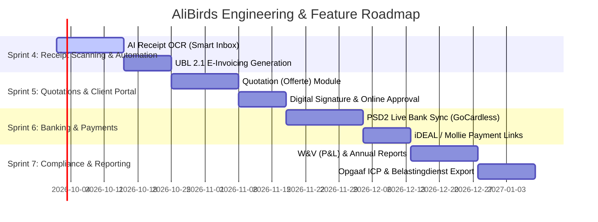

# Moneybird Competitive Benchmark & Feature Improvement Roadmap

> **Platform:** AliBirds (Dutch ZZP & SME Financial Management)  
> **Benchmark Competitor:** [Moneybird](https://www.moneybird.nl) (The Dutch Market Leader for Small Business Bookkeeping)  
> **Document Status:** Comprehensive Product Strategy & Feature Roadmap (English)  
> **Date:** September 2026

---

## Executive Summary

**AliBirds** has established a modern, lightning-fast foundation with a sleek interface, dual-mode VAT calculations (inclusive vs. exclusive), MT940 bank statement parsing, dual bank reconciliation (matching revenue invoices and costs), quarterly BTW-aangifte rubric calculations, and flexible client management.

**Moneybird** is the gold-standard benchmark in the Netherlands with over 250,000 active business users. While Moneybird is feature-rich, many users complain about steep tiered pricing, clutter, and slow support.

By executing this strategic roadmap, AliBirds can position itself as a **faster, smarter, and AI-first alternative** that saves Dutch entrepreneurs hours every week.

---

## 1. Feature Matrix: AliBirds vs. Moneybird

| Feature Area | Moneybird | AliBirds (Current) | AliBirds (Recommended) |
| :--- | :--- | :--- | :--- |
| **Sales Invoicing** | Advanced (PDF + UBL + Peppol) | Excellent (Interactive Editor, PDF, Email) | Add UBL 2.1 export & Peppol delivery |
| **Expenses & Receipts** | AI OCR Receipt Scanning (Smart Inbox) | Manual Entry & Bank-Assisted Cost Creation | Add AI Receipt OCR + Drag-and-Drop Inbox |
| **Bank Reconciliation** | PSD2 Live Bank Feeds + Auto-Match | MT940 Upload + 1-Click Match & Cost Creation | Add PSD2 Live Sync (GoCardless/Ponto) |
| **Tax Returns (Btw)** | 1-Click Digipoort Filing + ICP | Rubrics (1a, 1b, 2a, 4a, 5b) + Summary | Add Belastingdienst XML Export & ICP |
| **Quotations / Offertes** | Online Signatures & Auto-Conversion | Not yet implemented | High-priority addition for ZZP workflow |
| **Time & Mileage Tracking** | Built-in timer + €0.23/km mileage log | Not yet implemented | Crucial for Dutch ZZP *Urencriterium* |
| **Payment Reminders** | Automated Cadence (Friendly, 1st, Final) | Manual Resend | Automated cron-based reminder scheduling |
| **Payment Links** | Mollie / iDEAL / Bunq QR | Manual IBAN / Custom Payment Link | Direct Stripe / Mollie iDEAL integration |
| **Recurring Billing** | Subscription templates + SEPA | Basic recurring schedules | Auto-generation cron + Direct Debit (SEPA) |
| **Financial Reporting** | P&L (W&V), Balance Sheet, Audit Files | Dashboard KPIs + Quarterly Tax Return | Add P&L (Winst- en Verlies) & Audit Export |

---

## 2. Priority 1: High-Impact Differentiators (Next Sprints)

### 1. AI Receipt & Invoice Scanner ("Smart Inbox")
* **Why it matters:** In Moneybird, users rarely type expense details manually. They take a photo with their phone or drop a PDF into the inbox. Moneybird’s OCR scans the receipt and pre-fills the vendor, date, total amount, and VAT breakdown.
* **AliBirds Implementation:**
  - Create an **"Inbox / Bonnetjes"** dropzone in `/expenses`.
  - Use an AI Vision API (e.g., Supabase Edge Function with GPT-4o-mini Vision / Claude 3.5 Haiku) or Tesseract OCR.
  - Extract:
    - Vendor name (matched against existing registered vendors)
    - Invoice / receipt date
    - Total gross amount
    - Suggested VAT rate (21%, 9%, 0%, or Reverse Charge)
    - Calculated net amount & VAT amount
  - Preview the uploaded receipt side-by-side with the pre-filled form for 1-click confirmation.

### 2. Live Bank Synchronization via PSD2 (GoCardless / Ponto)
* **Why it matters:** Downloading MT940 files (.sta) from bank portals is a manual chore. Modern business owners expect automated overnight bank synchronization.
* **AliBirds Implementation:**
  - Integrate **GoCardless Bank Account Data** (formerly Nordigen), which offers free/low-cost PSD2 API access to all major Dutch and European banks:
    - **Rabobank, ING, ABN AMRO, Bunq, SNS, ASN, Knab, RegioBank**.
  - Provide a **"Verbind uw bank"** (Connect Bank) button in Settings.
  - Automatically fetch transactions daily into the existing `bank_transactions` table, running our auto-reconciliation engine in the background.

### 3. Quotations & Estimates (Offertes met Digitale Handtekening)
* **Why it matters:** Most freelancers start customer engagements with a quotation. Moneybird allows clients to digitally sign quotations online with a button click.
* **AliBirds Implementation:**
  - Introduce `/estimates` or `/quotes`.
  - Reuse the invoice line-item editor with customized quotation styling and terms.
  - Generate a secure public review link (e.g., `alibirds.app/quote/[id]?token=...`).
  - Add an **"Akkoord geven"** (Approve & Sign) button with client name, signature drawing pad, and confirmation timestamp.
  - Automatically trigger:
    - Email notification to the user: *"Klant heeft offerte goedgekeurd!"*
    - 1-Click action: **"Omzetten naar Factuur"** (Convert to Invoice).

### 4. UBL 2.1 E-Invoicing & Peppol Compliance
* **Why it matters:** Since 2024, EU governments and Dutch municipalities require electronic invoices formatted as **UBL 2.1 (Universal Business Language)** XML files. Invoices sent without UBL are increasingly rejected by corporate and government buyers.
* **AliBirds Implementation:**
  - Whenever an invoice is generated, generate both the PDF and a standardized `ubl.xml` (using standard PEPPOL BIS Billing 3.0 specs).
  - Embed the UBL XML inside the email attachments alongside the PDF so accounting software on the client's side (Moneybird, Exact Online, Twinfield) imports it automatically.

---

## 3. Priority 2: Automation & Workflow Enhancements

### 5. Automated Dunning & Payment Reminders (Aanmaningen)
* **Moneybird Standard:** 
  - Due date passed + 3 days: Automated friendly reminder email.
  - Due date passed + 14 days: Second notice.
  - Due date passed + 30 days: Final demand (ingebrekestelling) including statutory interest and collection costs (*WIK - Wet Incassokosten*).
* **AliBirds Roadmap:**
  - Add reminder settings in `/settings`: Configure template texts and reminder intervals.
  - In `/invoices`, show status badges: `OVERDUE (3 dagen)`, `HERINNERING VERZONDEN`.
  - Provide both a manual 1-click **"Stuur herinnering"** button and an option for **"Automatisch herinneren"**.

### 6. iDEAL & Online Payments (Mollie / Stripe Integration)
* **Moneybird Standard:** Every Moneybird invoice includes a direct **"Betaal direct met iDEAL"** payment button. Invoices are automatically marked as `PAID` the moment the webhook fires.
* **AliBirds Roadmap:**
  - Support entering a **Mollie API key** or **Stripe publishable/secret key** in Settings.
  - Invoices generated with online payments enabled will feature a prominent pay button on the client portal and in invoice emails.
  - A webhook handler (`/api/webhooks/mollie`) automatically updates `invoice.status = 'PAID'`, `invoice.paid_at = now()`, and triggers bank reconciliation.

### 7. Time & Mileage Tracking for Dutch Tax Benefits (*Urencriterium*)
* **The Dutch Context:** To qualify for the Dutch entrepreneur allowance (*Zelfstandigenaftrek* and *Startersaftrek*), freelancers must prove they worked at least **1,225 hours per year** in their business. Furthermore, business trips with personal vehicles can be deducted at **€0.23 per kilometer**.
* **AliBirds Roadmap:**
  - **Urenregistratie (Time Tracking):** Simple start/stop timer and manual entry by client/project.
  - **Rittenregistratie (Mileage Tracking):** From/To address, kilometers driven, calculated deduction (€0.23/km), and 1-click booking as a business expense.
  - **Direct billing:** Ability to select logged unbilled hours and generate an invoice with 1 click.

---

## 4. Priority 3: Accounting & Reporting Depth

### 8. Profit & Loss (Winst- en Verliesrekening) & Balance Sheet
* **Current State:** AliBirds provides quarterly VAT rubrics and dashboard revenue/cost cards.
* **Recommended Addition:**
  - Create `/reports`:
    - **Winst- en Verliesrekening (P&L):**
      - Net Turnover (Omzet)
      - Direct Costs (Inkoopkosten)
      - Gross Margin (Brutomarge)
      - Operating Expenses categorized (Software, Marketing, Travel, Office, Advisory)
      - Net Profit before Tax (Resultaat voor belasting)
    - **Year-over-Year comparison:** Compare 2025 vs 2026 performance with bar charts.
    - **Export to PDF & Excel:** For annual tax filing (*Inkomstenbelasting / VPB*).

### 9. ICP Declaration (Opgaaf Intracommunautaire Prestaties)
* **The Dutch Context:** When invoicing clients in other EU countries (e.g., Germany, France, Belgium) with reverse-charge VAT (*Btw verlegd*), Dutch entrepreneurs must file a quarterly **Opgaaf ICP** alongside their regular BTW-aangifte.
* **AliBirds Roadmap:**
  - In `/tax-return`, add an **"Opgaaf ICP"** tab.
  - Automatically filter all invoices with EU clients and reverse charge VAT (`vat_rate: 'REVERSE_CHARGE'`).
  - Summarize total deliverable value grouped by the client’s EU VAT number for effortless copy-pasting to the Belastingdienst.

### 10. Audit File Export (XAF / Auditfile Financieel)
* **Why it matters:** Dutch accountants and the Belastingdienst frequently request an **Auditfile Financieel (XAF 3.2)** for yearly accounts or audits.
* **AliBirds Roadmap:**
  - Add an **"Exporteer Auditfile (XAF)"** button in Settings / Reports that bundles clients, suppliers, invoices, expenses, and bank transactions into a standardized XML format compatible with Exact Online, Twinfield, and SnelStart.

---

## 5. UI/UX Polish: Winning on Speed and Elegance

| Feature | Moneybird Experience | AliBirds Advantage / Opportunity |
| :--- | :--- | :--- |
| **Theme & Visuals** | Dated light theme with cluttered sidebars | **Sleek dark/light modern UI with glassmorphic cards and instant responsive speed.** |
| **Keyboard Navigation** | Limited shortcuts | **Add `Cmd+K` Command Bar for instant search and shortcuts (`M` to match, `N` for new invoice).** |
| **Mobile Experience** | Dedicated native app | **Add Progressive Web App (PWA) manifest and offline mobile-first actions.** |
| **Customer Support** | Slow email ticketing queue | **Add built-in AI accounting assistant to answer Dutch VAT questions (e.g., "Is lunch deductible?").** |
| **Transparency & Speed** | Heavy enterprise feel | **Zero bloat, instant page transitions (<100ms), and no hidden sub-menus.** |

---

## 6. Execution Roadmap

---

*Authored by Antigravity AI Engineering for AliBirds.*
